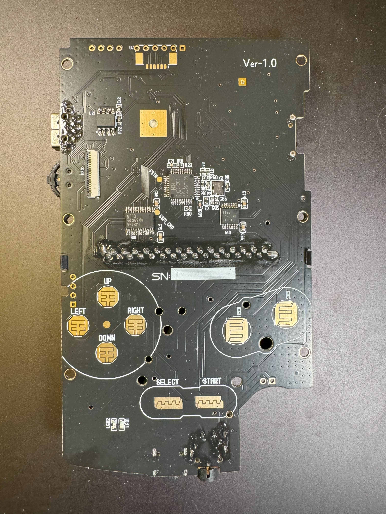

# GWGBC_FW

WARNING: There are several different versions of the hardware out in the wild now and the firmware is specific to the revision. Flashing the wrong firmware for your device is possible but will render your device unusable until you update again with the matched firmware. Please ensure you read through the entire repo before flashing. 

If your v1.0 device works and you're not missing \<feature\> that was added after release, probably just leave well enough alone. If you insist anyway but are having trouble deciding what to install, [this firmware](HWv1_0/1117/) seems to be working pretty well. 

If you've reflashed your v1.1 device with v1.0 firmware, please reflash with [firmware meant for v1.1 hardware.](HWv1_1/) Else your device will refuse to boot carts until you do. 

My video on the v1.0 hardware:

To proceed to firmware files, pick your hardware appropriately. **Click** the image that matches the device you have. Note the version number in the top right corner. 

Please [reach out to funnyplaying directly](https://funnyplaying.com/pages/contact-us) if you have any bug reports or feature requests not listed below. 

I've made lots of feature requests of funnyplaying and they've implemented at least some. We're still working out the kinks. Here is a short list of things that *have already been requested and acknowledged by funnyplaying*:
* LUTs for display accurate color correction (planned for future FW)
* More pixel grid modes; feature parity with their Game Boy Color Q5 laminated backlight kit (planned for future FW)
* Lower minimum speaker volume[^1]
* SD Card support
  * Flashing flashcarts (e.g. to replace burnmaster)
  * system updates
  * save states
  * and you know why. 
* Game Boy Advance support
* IR functionality
* AA battery support (really, guys?)
* faster charging

Funnyplaying has mentioned some of these features in a way that sounds like they're trying to add to the next FW revision (pixel grid modes). From the inception of the device, Funnyplaying has planned IR function but since the retail boards have shipped without the requisite hardware, I wouldn't hold my breath. I'd treat the rest of these features like that too. Other features they want to add not just to the device but to their backlight kits too (like LUTs) and I expect them to show up there first. 

~~In the short term, funnyplaying is planning a minor hardware revision to address some issues. I don't know what specifically, but I'd expect faster charging support and probably a much less tempermental firmware updater. Maybe a larger internal EEPROM to give more space for more *yet to be implemented* features. I expect these devices to start shipping without any fanfare and I'd expect them as early as batch two or three.~~ This was HW v1.1 and I'm not sure what all changed besides the addition of an external clock reference. In this short term, I also expect two re-releases of this device, one in DMG form-factor and another in MGB form-factor. The internal hardware, support, and features will be identical to this version, only the shape of the boards will be different for install in the respective shells. 

While SD Card support and Game Boy Advance functionality are both planned features, I would not expect either until a full hardware refresh happens and seeing as the engineering team is currently occupied finishing this device (despite it's very recent release), I don't expect that for a while. Probably two to three years, given funnyplaying's track record with promises and deliveries. Funnyplaying iterates on hardware designs though and now that they've gotten all their iterative designs working together, development may hasten. 

[^1]: So this console is so authentic, the amp makes a noticeable buzzing noise that sounds eerily similar to the CPU sound leaks on actual CGBs. Funnyplaying intentionally gimps the minimum volume levels to mask this. (It's not the same noise, just similar)
